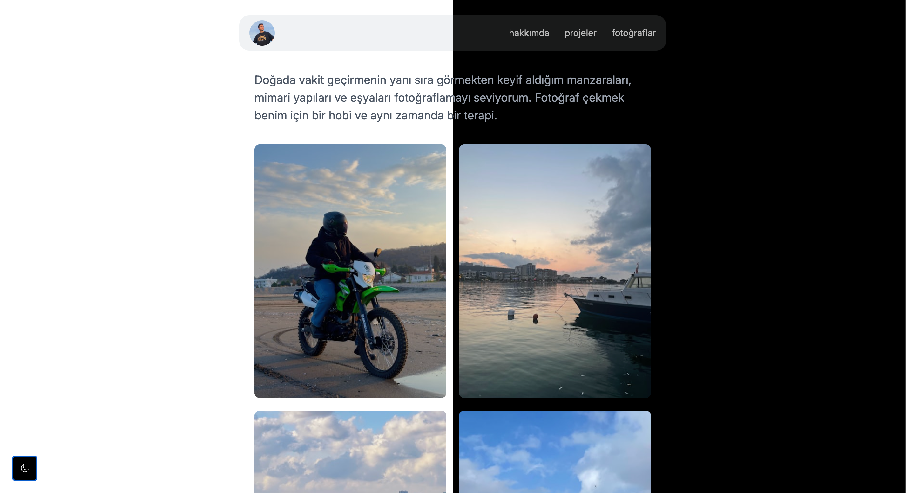

# Photos



# EN - Personal Portfolio

This project is a personal portfolio website. It is developed using React and Tailwind CSS, allowing the user to showcase their projects and photos.

## Features

- **Home Page**: A page where the user provides information about themselves and showcases their latest projects.
- **Projects Page**: A page listing the projects developed by the user. Each project includes a GitHub link and a demo link.
- **Photos Page**: A page displaying photos taken by the user via the Unsplash API.
- **Navigation Bar**: A navigation bar allowing the user to navigate between pages.

## Setup

To run the project locally, follow these steps:

1. Clone this repository:
    ```bash
    git clone https://github.com/kemalgundogdu/portfolio.git
    ```

2. Navigate to the project directory:
    ```bash
    cd portfolio
    ```

3. Install the required dependencies:
    ```bash
    npm install
    ```

4. Set up the environment variables:
    Create a `.env` file and add your Unsplash API key and username:
    ```plaintext
    REACT_APP_UNSPLASH_ACCESS_KEY=your_access_key
    REACT_APP_UNSPLASH_USERNAME=your_username
    ```

5. Start the project:
    ```bash
    npm start
    ```

## Technologies Used

- **React**: For building the user interface.
- **Tailwind CSS**: For styling and design.
- **Unsplash API**: For fetching photos.
- **Axios**: For making API requests.

## Contributing

If you would like to contribute, please submit a pull request or open an issue.

## License

This project is licensed under the MIT License.

---

# TR - Kişisel Portföy

Bu proje, kişisel portföy web sitesidir. Proje, React ve Tailwind CSS kullanılarak geliştirilmiştir ve kullanıcıya projelerini ve fotoğraflarını sergileme imkanı sunar.

## Özellikler

- **Ana Sayfa**: Kullanıcının kendisi hakkında bilgi verdiği ve son projelerini sergilediği bir sayfa.
- **Projeler Sayfası**: Kullanıcının geliştirdiği projeleri listelediği bir sayfa. Her proje için GitHub bağlantısı ve demo bağlantısı bulunmaktadır.
- **Fotoğraflar Sayfası**: Kullanıcının Unsplash API'si aracılığıyla çektiği fotoğrafları sergilediği bir sayfa.
- **Navigasyon Çubuğu**: Kullanıcının sayfalar arasında gezinmesini sağlayan bir navigasyon çubuğu.

## Kurulum

Projeyi yerel ortamınızda çalıştırmak için aşağıdaki adımları izleyin:

1. Bu depoyu klonlayın:
    ```bash
    git clone https://github.com/kemalgundogdu/portfolio.git
    ```

2. Proje dizinine gidin:
    ```bash
    cd portfolio
    ```

3. Gerekli bağımlılıkları yükleyin:
    ```bash
    npm install
    ```

4. Çevresel değişkenleri ayarlayın:
    `.env` dosyasını oluşturun ve Unsplash API anahtarınızı ve kullanıcı adınızı ekleyin:
    ```plaintext
    REACT_APP_UNSPLASH_ACCESS_KEY=your_access_key
    REACT_APP_UNSPLASH_USERNAME=your_username
    ```

5. Projeyi başlatın:
    ```bash
    npm start
    ```

## Kullanılan Teknolojiler

- **React**: Kullanıcı arayüzünü oluşturmak için.
- **Tailwind CSS**: Stil ve tasarım için.
- **Unsplash API**: Fotoğrafları çekmek için.
- **Axios**: API isteklerini yapmak için.

## Katkıda Bulunma

Katkıda bulunmak isterseniz, lütfen bir pull request gönderin veya bir issue açın.

## Lisans

Bu proje MIT Lisansı ile lisanslanmıştır.
